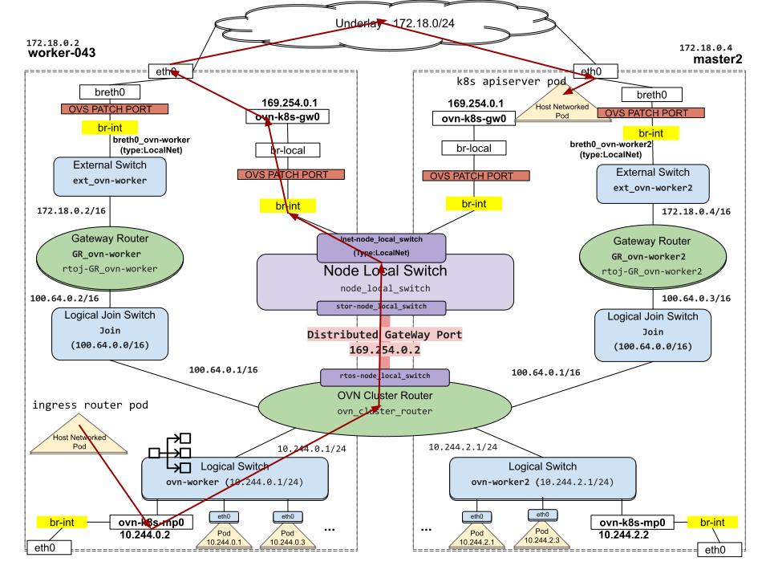

# Traffic Dropped at br-local

BZ link: https://bugzilla.redhat.com/show_bug.cgi?id=2024777  
Component: OVN-Kubernetes  
OCP version: 4.6.17  
OVN Version: 20.06.2-11.el8fdp.x86_64  
OVS Version: 2.13.0-72.el8fdp.x86_64  
Number of Nodes: 100 (+3 masters)

## Problem Statement

It was observed that `openshift-authentication`, `openshift-console`, `openshift-insights` & `openshift-ingress` operators were in degraded state.

## Process

- We looked at the logs of the authentication and console operators. They were failing with the `failed to GET route` error.
- We checked the ingress operator logs next and saw that the router pods in openshift-ingress namespace were running but the containers were not ready.
- Looking at the ingress container logs, we saw `Failed to make webhook authenticator request: Post "https://198.223.0.1:443/apis/authentication.k8s.io/v1/tokenreviews": dial tcp 198.223.0.1:443: connect: connection refused` errors.
- This lead us to believe that router pod which was host-networked on worker-043 node was unable to reach the kubernetes clusterIP API service (198.223.0.1:443).
- We ssh-ed into worker-043 node and ran:
```
curl -vk https://198.223.0.1:443/api/v1/services
*   Trying 198.223.0.1...
* TCP_NODELAY set
* connect to 198.223.0.1 port 443 failed: Connection timed out
* Failed to connect to 198.223.0.1 port 443: Connection timed out
* Closing connection 0
curl: (7) Failed to connect to 198.223.0.1 port 443: Connection timed out
```
- At this point it was clear that traffic from a host-networked pod towards a service backed by host-networked pods wasn't working in the cluster since both the router pods on worker-043 & worker-075 were behaving in the same manner.
- The OVN host2svc2host traffic flow looks like this:



- Traffic flows from router pod which is host-networked on worker-043, enters OVN via `ovn-k8s-mp0` management port interface. At this point there is a SNAT from worker-043 nodeIP -> mp0's interface IP. It then enters the node local switch and hits the load balancer on the switch. The destination which is the clsuterIP 198.223.0.1:443 gets DNAT-ed to one of the 3 master nodeIPs, since the api-server pods are also host-networked. It then goes to `ovn_cluster_router` where the 1003 inter-node-policy routes it to `ovn-k8s-gw0` via DGP. It goes to br-local and leaves the worker via eth0 and then proceeds to master2 node via underlay.
- We started to trace the packet step by step
  - Doing a `tcpdump -i ovn-k8s-mp0 | grep 198.223.0.1` showed that packets were entering OVN via mp0 interface.
  - Next we tried to do a `tcpdump -i ovn-k8s-gw0` and we saw nothing arriving there. This was a red flag.
  - We then tried `curl -kv --local-port 3636 198.223.0.1:443` and grepped for conntrack entries. We could see the SYN packet going via mp0 (192.168.88.2), getting dnated to master2 (10.56.166.11:6443), getting routed to gw0 (169.254.12.181). But no SYN-ACKs were being received.
    ```
    ovs-appctl dpctl/dump-conntrack | grep 3636
    tcp,orig=(src=192.168.88.2,dst=10.56.166.11,sport=3636,dport=6443),reply=(src=10.56.166.11,dst=169.254.12.181,sport=6443,dport=3636),zone=270,protoinfo=(state=SYN_SENT)
    tcp,orig=(src=192.168.88.2,dst=198.223.0.1,sport=3636,dport=443),reply=(src=10.56.166.11,dst=192.168.88.2,sport=6443,dport=3636),zone=166,labels=0x2,protoinfo=(state=SYN_SENT)
    tcp,orig=(src=192.168.88.2,dst=198.223.0.1,sport=3636,dport=443),reply=(src=198.223.0.1,dst=192.168.88.2,sport=443,dport=3636),protoinfo=(state=SYN_SENT)
    ```
  - We did an ovs trace to determine where the packet was getting dropped. See the full trace here: https://gist.github.com/tssurya/40ef66b11cae793e03cc5e7231e9de6f. We saw that the packet enters br-local from br-int but gets dropped on br-local and doesn't leave the worker-043.
    ```
    bridge("br-local")
                ------------------
                 0. reg0=0x2, priority 0
                    drop
            set_field:0x8001->reg15
    pop:NXM_OF_IN_PORT[]
     -> NXM_OF_IN_PORT[] is now 118

    ```
  - We tried to list the flows on br-local to see which flow was dropping the packet.
    ```
    [root@worker-043 ~]# ovs-ofctl dump-flows br-local
    cookie=0x0, duration=11961.945s, table=0, n_packets=7, n_bytes=746, priority=100,in_port="ovn-k8s-gw0" actions=output:2
    cookie=0x0, duration=11961.945s, table=0, n_packets=0, n_bytes=0, priority=100,in_port=2 actions=output:"ovn-k8s-gw0"
    [root@worker-043 ~]#
    ```
    where ofport 2 was ext-vxlan. These flows were wrong. Hence packets were getting dropped at `ovn-k8s-gw0`.

## Workaround

To fix the wrongly programmed flows, we added the right flow to br-local on all worker nodes:
```
[root@worker-043 ~]# ovs-ofctl add-flow br-local action=normal
[root@worker-043 ~]# ovs-ofctl dump-flows br-local
 cookie=0x0, duration=23.709s, table=0, n_packets=1938, n_bytes=3235317, actions=NORMAL
```
This did the trick and packets started flowing out of `ovn-k8s-gw0` into the worker and were able to hit the k8s apiserver backend pods. The operators also stopped being degraded. This solved the problem for the time being.

## Conclusion

To find a proper fix, we tried to investigate who was wrongly programming the flows. We picked a specific node, deleted all flows on `br-local`. Then restarted the `ovnkube-node` and `ovn-controller` components. Rechecking the br-local flows, it was clear that they both weren't the culprits since no flows were added to `br-local`. We then rebooted the node and then saw the wrong flows getting re-added to `br-local` again which made something else running on the node, the suspect. Looking at the OVS openvswitchd logs, we saw:
```
2021-11-19T16:24:32.448Z|00666|connmgr|INFO|br-local<->unix#3: 1 flow_mods in the last 0 s (1 deletes)
2021-11-19T16:24:32.454Z|00667|connmgr|INFO|br-local<->unix#6: 2 flow_mods in the last 0 s (2 adds)
```
and checking unix 3 socket:
```
unix  3      [ ]         STREAM     CONNECTED     940841   /var/run/openvswitch/db.sock
```

Clearly something was triggering an ovs-ofctl add-flow/del-flow and programming the flows wrongly for some reason. It was deleting the `NORMAL` flow and adding two wrong flows. We then realised that there was a machine-config-daemonset running on each node that was running a script which deleted all the flows on br-local and added these wrong flows - apparently this hack was needed in older OCP 4.4.5 versions:
```
/bin/ovs-ofctl del-flows br-local
/bin/ovs-ofctl add-flows br-local -<<EOF
table=0,priority=100,in_port=1,actions=output:2
table=0,priority=100,in_port=2,actions=output:1
```
We deleted this MC from all the nodes and that fixed this issue. We then proceeded with upgrading to newer OCP version.