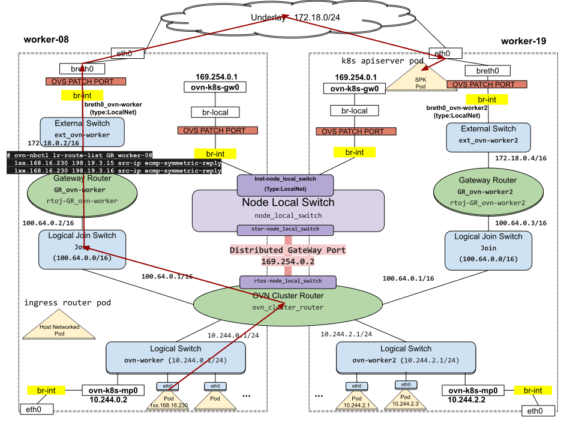

# Traffic Dropped at br-local

BZ link: https://bugzilla.redhat.com/show_bug.cgi?id=2095444  
Component: OVN-Kubernetes  
OCP version: 4.7.37  
OVN Version: ovn2.13-20.12.0-183.el8fdp.x86_64  
OVS Version: 2.13-2.13.0-79.el8fdp.x86_64  
Number of Nodes: 20 (+3 masters)

## Problem Statement

We were seeing a rogue MAC `ce:73:29:66:39:a4` in the tcpdumps that were captured on the egress interface on `worker-08` (egress traffic coming from the app pod `app-pgw-session-bc8887c9c-xkwvx` [ 1xx.168.16.230]).
```
app-pgw-session-bc8887c9c-xkwvx  2/2    Running  0         25d  1xx.168.16.230  worker-08
```

TCPDUMP:
```
22:48:28.272309 94:42:c9:c3:f7:92 > 76:9c:19:34:50:26, ethertype IPv4 (0x0800), length 94: 1xx.168.16.230.42397 > 172.27.xxx.13.commplex-main: UDP, length 52
22:48:28.272315 94:42:c9:c3:f7:92 > ce:73:29:66:39:a4, ethertype IPv4 (0x0800), length 94: 1xx.168.16.230.59943 > 172.27.xxx.13.commplex-main: UDP, length 52
22:48:28.272340 94:42:c9:c3:f7:92 > ee:8d:82:db:f9:c4, ethertype IPv4 (0x0800), length 94: 1xx.168.16.230.53072 > 172.27.xxx.13.commplex-main: UDP, length 52
22:48:28.272342 94:42:c9:c3:f7:92 > 76:9c:19:34:50:26, ethertype IPv4 (0x0800), length 94: 1xx.168.16.230.34401 > 172.27.xxx.13.commplex-main: UDP, length 52
22:48:28.272349 94:42:c9:c3:f7:92 > 76:9c:19:34:50:26, ethertype IPv4 (0x0800), length 94: 1xx.168.16.230.crescoctrl-disc > 172.27.xxx.13.commplex-main: UDP, length 52
22:48:29.073221 94:42:c9:c3:f7:92 > ce:73:29:66:39:a4, ethertype IPv4 (0x0800), length 94: 1xx.168.16.230.42788 > 172.27.xxx.13.commplex-main: UDP, length 52
22:48:29.073245 94:42:c9:c3:f7:92 > 76:9c:19:34:50:26, ethertype IPv4 (0x0800), length 94: 1xx.168.16.230.45276 > 172.27.xxx.13.commplex-main: UDP, length 52
22:48:29.073253 94:42:c9:c3:f7:92 > ee:8d:82:db:f9:c4, ethertype IPv4 (0x0800), length 94: 1xx.168.16.230.60265 > 172.27.xxx.13.commplex-main: UDP, length 52
22:48:29.073268 94:42:c9:c3:f7:92 > 76:9c:19:34:50:26, ethertype IPv4 (0x0800), length 94: 1xx.168.16.230.45460 > 172.27.xxx.13.commplex-main: UDP, length 52
22:48:29.073286 94:42:c9:c3:f7:92 > 76:9c:19:34:50:26, ethertype IPv4 (0x0800), length 94: 1xx.168.16.230.37957 > 172.27.xxx.13.commplex-main: UDP, length 52
22:48:29.273052 94:42:c9:c3:f7:92 > 76:9c:19:34:50:26, ethertype IPv4 (0x0800), length 94: 1xx.168.16.230.42397 > 172.27.xxx.13.commplex-main: UDP, length 52
22:48:29.273067 94:42:c9:c3:f7:92 > ce:73:29:66:39:a4, ethertype IPv4 (0x0800), length 94: 1xx.168.16.230.59943 > 172.27.xxx.13.commplex-main: UDP, length 52
22:48:29.273083 94:42:c9:c3:f7:92 > ee:8d:82:db:f9:c4, ethertype IPv4 (0x0800), length 94: 1xx.168.16.230.53072 > 172.27.xxx.13.commplex-main: UDP, length 52
22:48:29.273093 94:42:c9:c3:f7:92 > 76:9c:19:34:50:26, ethertype IPv4 (0x0800), length 94: 1xx.168.16.230.34401 > 172.27.xxx.13.commplex-main: UDP, length 52
22:48:29.273106 94:42:c9:c3:f7:92 > 76:9c:19:34:50:26, ethertype IPv4 (0x0800), length 94: 1xx.168.16.230.crescoctrl-disc > 172.27.xxx.13.commplex-main: UDP, length 52
22:48:30.028992 94:42:c9:c3:f7:92 > ce:73:29:66:39:a4, ethertype IPv4 (0x0800), length 133: 1xx.168.16.230.59943 > 172.27.xxx.13.commplex-main: UDP, length 91
22:48:30.074011 94:42:c9:c3:f7:92 > ce:73:29:66:39:a4, ethertype IPv4 (0x0800), length 94: 1xx.168.16.230.42788 > 172.27.xxx.13.commplex-main: UDP, length 52
22:48:30.074031 94:42:c9:c3:f7:92 > ee:8d:82:db:f9:c4, ethertype IPv4 (0x0800), length 94: 1xx.168.16.230.60265 > 172.27.xxx.13.commplex-main: UDP, length 52
22:48:30.074033 94:42:c9:c3:f7:92 > 76:9c:19:34:50:26, ethertype IPv4 (0x0800), length 94: 1xx.168.16.230.45460 > 172.27.xxx.13.commplex-main: UDP, length 52
```

## Process

- We looked at the namespaces to see which SPK F5 pod's were serving this app pod. It was being by served by two F5 pods:
```
$ oc get pods -n spk -o wide
   NAME                    READY  STATUS   RESTARTS  AGE  IP             NODE
   f5-SPK1-c8d8885bb-ccccc  4/4    Running  0         14d  192.168.12.42  worker-18  ----> net1 sriov interface IP 198.19.3.16
   f5-SPK2-c8d8885bb-qqqqq  4/4    Running  0         21h  192.168.10.43  worker-19  ----> net1 sriov interface IP 198.19.3.15

```
- We then checked the corresponding ECMP routes in NBDB for these ICNI pods:
```
# ovn-nbctl lr-route-list GR_worker-08 | grep 16.230
           1xx.168.16.230               198.19.3.15 src-ip ecmp ecmp-symmetric-reply
           1xx.168.16.230               198.19.3.16 src-ip ecmp ecmp-symmetric-reply
```

- The OVN pod2external traffic flow looks like this:


- Checking the MAC Bindings table in the SBDB, we saw:
```
_uuid               : 397895cc-03b0-4dc0-8746-e9459fe83e2d         
datapath            : 483669d5-4952-4330-bd3f-f3933341b68f
ip                  : "198.19.3.15"   
logical_port        : rtoe-GR_worker-08           
mac                 : "ee:8d:82:db:f9:c4"
=====
_uuid               : b80d352c-023b-4ad7-8e23-4fee8591f928 
datapath            : 483669d5-4952-4330-bd3f-f3933341b68f    
ip                  : "198.19.3.16" 
logical_port        : rtoe-GR_worker-08           
mac                 : "76:9c:19:34:50:26"
=====
_uuid               : 1ffb3b76-86d5-4e82-8eb4-704a2b71b8a2 
datapath            : 483669d5-4952-4330-bd3f-f3933341b68f 
ip                  : "fe80::cc73:29ff:fe6b:39a4" 
logical_port        : rtoe-GR_worker-08   
mac                 : "ce:73:29:66:39:a4" 
```
- There was a stale MAC binding for rougue MAC `ce:73:29:66:39:a4` towards an IPV6 link interface which wasn't active (SBDB MAC Bindings live on forever). However based on the current status since pod is served only by 2 SPK's we should be seeing either `ee:8d:82:db:f9:c4` OR `76:9c:19:34:50:26` only in the tcpdumps. It was strange every 3rd packet had the destination MAC as the rougue MAC.
- Running ovn-trace and ovs-trace gave the expected results and the rougue MAC wasn't visible in the traces.
- Looking carefully at the tcpdumps, we then saw that source ports were always `59943` or `42788` whenever the wrong MAC (`ce:73:29:66:39:a4`) was seen as destination MAC. Other ports in the tcpdump had the right MACs.
- We then checked the conntrack entries. Due to constant traffic flow from reused UDP src ports the conntrack entries were stale but not getting removed:
```
$ grep labels worker-08.sudo_ovs-dpctl_dump-conntrack  | grep ce73296b39a4
udp,orig=src=172.27.xxx.13,dst=1xx.168.16.230,sport=5005,dport=42788),reply=src=1xx.168.16.230,dst=172.27.xxx.13,sport=42788,dport=5005),zone=35,labels=0x2ce73296639a400000000
udp,orig=src=172.27.xxx.13,dst=1xx.168.16.230,sport=5005,dport=59943),reply=src=1xx.168.16.230,dst=172.27.xxx.13,sport=59943,dport=5005),zone=35,labels=0x2ce73296639a400000000
```
- In SBDB we have a flow:
```
ovn-sbctl dump-flows GR_worker-08  | grep ct_label.ecmp_reply_eth | grep 1xx.168.16.230
  table=7 (lr_in_ecmp_stateful), priority=100  , match=(inport == "rtoe-GR_worker-08" && ip4.dst == 1xx.168.16.230 && (ct.new && !ct.est)), action=(ct_commit { ct_label.ecmp_reply_eth = eth.src; ct_label.ecmp_reply_port = 2;}; next;)
```
that learns the src MAC of an incoming packet and saves it in the ct_label field of the entry [labels=0x2ce73296639a400000000 in the conntrack entry is the wrong MAC ce:73:29:66:39:a4] and then reuses the MAC as the ECMP reply MAC based on the conntrack entry's ct.label. So since we had a stale conntrack entry, we were seeing packets sent from ports 42788 and 59943 having a destination MAC set to the wrong MAC. This explains why we are seeing wrong MACs in the tcpdump. Note that packets coming from other ports in the tcpdump have the correct MACs of the SPKs.
- We then saw that out of the two SPK's one of them was recreated recently:
```
 f5-SPK2-c8d8885bb-qqqqq  4/4    Running  0         21h  192.168.10.43  worker-19 ----> net1 sriov interface IP 198.19.3.15
 ```
Looking at ovnkube-master logs, prior to this, there was another SPK f5-SPK0-c8d8885bb-sssss (192.168.10.42) which was also on worker-19. This was deleted and qqqqq was created at:
```
2022-06-07T20:13:55.104219372Z 2022-06-07T20:13:55Z|00186|binding|INFO|Claiming lport spk_f5-SPK2-c8d8885bb-qqqqq for this chassis.
2022-06-07T20:13:55.104336345Z 2022-06-07T20:13:55Z|00187|binding|INFO|spk_f5-SPK2-c8d8885bb-qqqqq: Claiming 0a:58:c0:a8:0a:2b 192.168.10.43
```
- Looking at the dmesg kernel logs on worker-19:
```
[core@worker-19 ~]$ uptime
 00:14:38 up 50 days,  8:29,  1 user,  load average: 5.56, 5.36, 5.29

[4163239.596288] i40e 0000:d8:00.0: VF 48 is now untrusted
```
We could see that approximately 2.5 days ago which aligns with the time when the SPK pod was recreated the VF 48 was untrusted as in stopped from use. And as we know that VF 48:
```
vf 48     link/ether ce:73:29:66:39:a4 brd ff:ff:ff:ff:ff:ff, spoof checking on, link-state auto, trust off
    RX: bytes  packets  mcast   bcast   dropped 
    333081     2306     0       878     0        
    TX: bytes  packets   dropped 
    0          0        0        
```
is our culprit with the rougue MAC. So this proves the fact that the older SPK f5-SPK0-c8d8885bb-sssss's net1 sriov interface was plugged into VF 48. That explains the stale conntrack entry.

## Workaround

To temporarily fix the problem, we deleted the conntrack entries:
```
   $ oc -n openshift-ovn-kubernetes exec pod/ovnkube-node-55555 -c ovnkube-node -- conntrack -D -p udp -l 0x2ce73296639a400000000
OR
   $ oc -n openshift-ovn-kubernetes exec pod/ovnkube-node-55555 -c ovnkube-node -- conntrack -D -p udp -s 172.27.xxx.13 -d 1xx.168.16.230 -r 1xx.168.16.230 -q 172.27.xxx.13 --sport 5005 --dport 59943 --reply-port-src 59943 --reply-port-dst 5005
   $ oc -n openshift-ovn-kubernetes exec pod/ovnkube-node-55555 -c ovnkube-node -- conntrack -D -p udp -s 172.27.xxx.13 -d 1xx.168.16.230 -r 1xx.168.16.230 -q 172.27.xxx.13 --sport 5005 --dport 42788 --reply-port-src 42788 --reply-port-dst 5005
```

## Conclusion

Proper fix will go into OVN/OVNK to have a better way to determine the nexthop MAC when using ECMP routes, specially to handle situations where the route or nexthop changes like in this case.